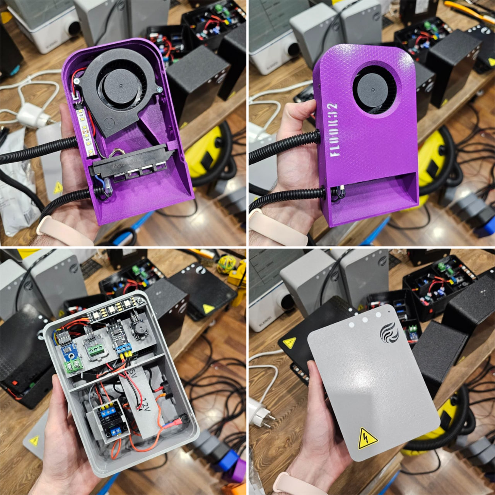
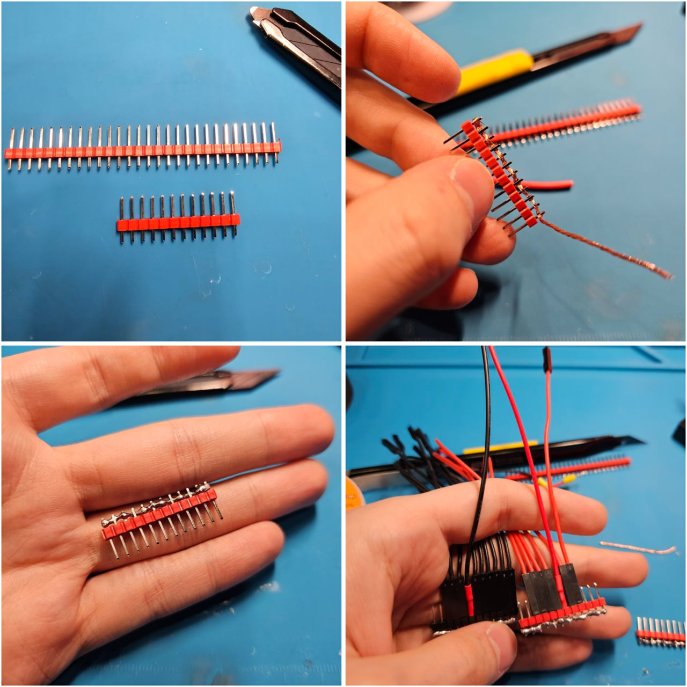
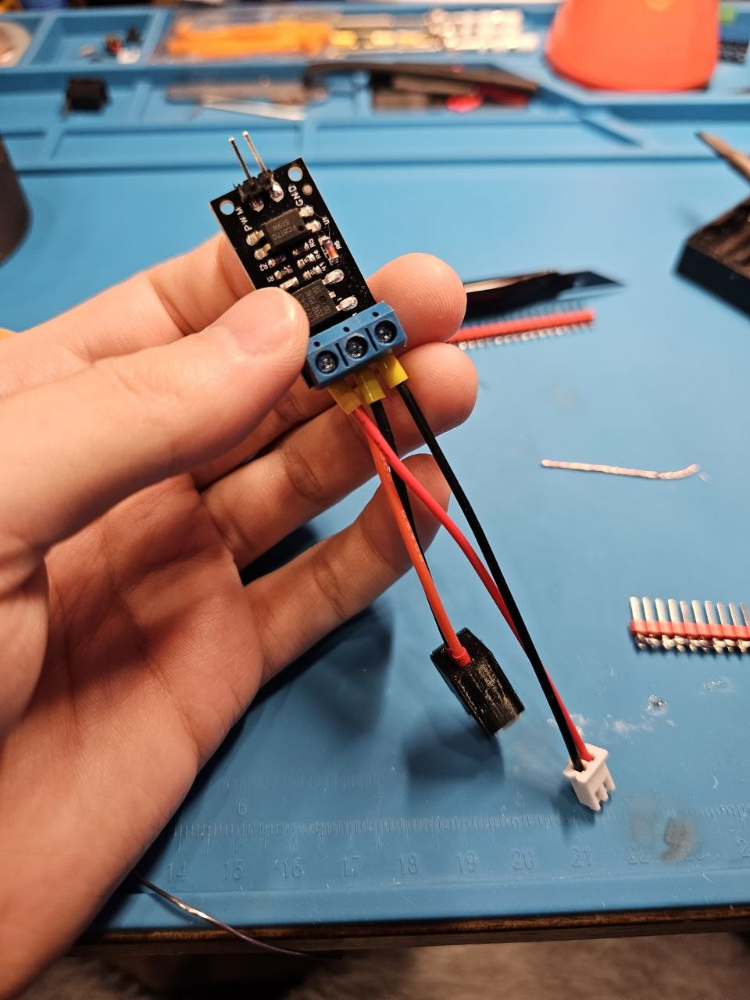
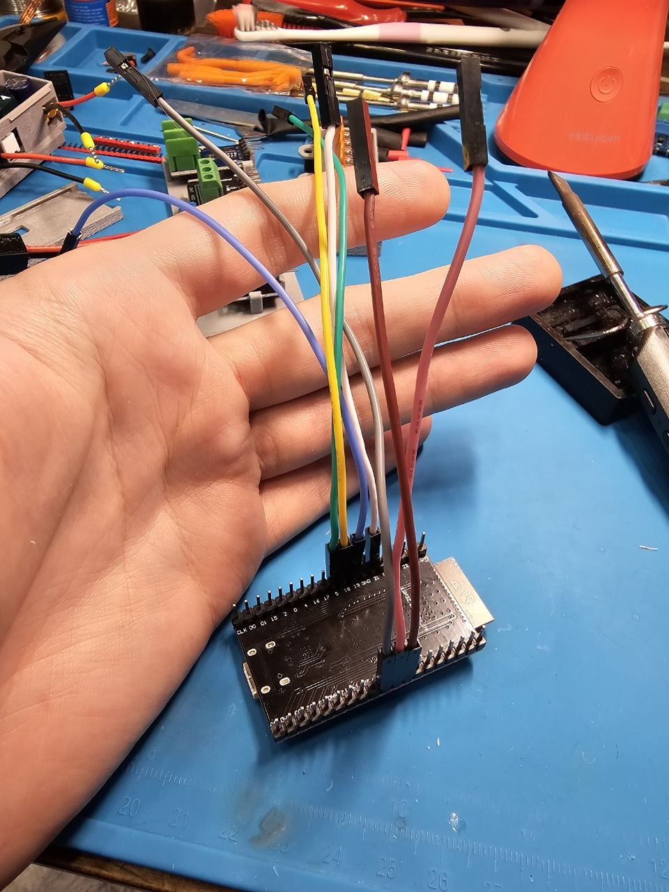
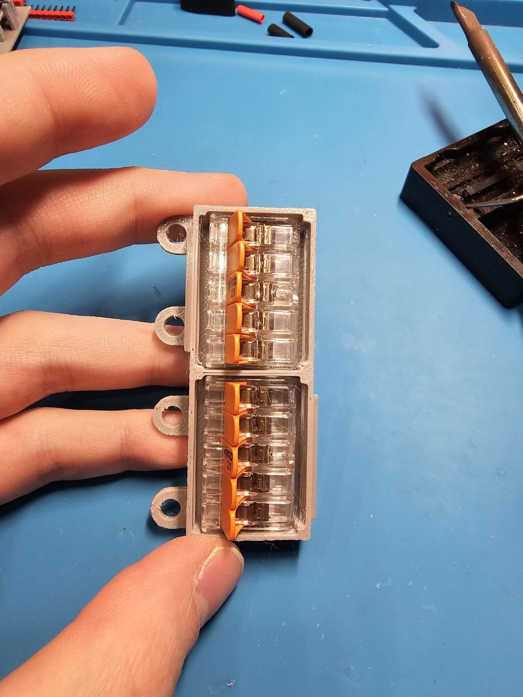
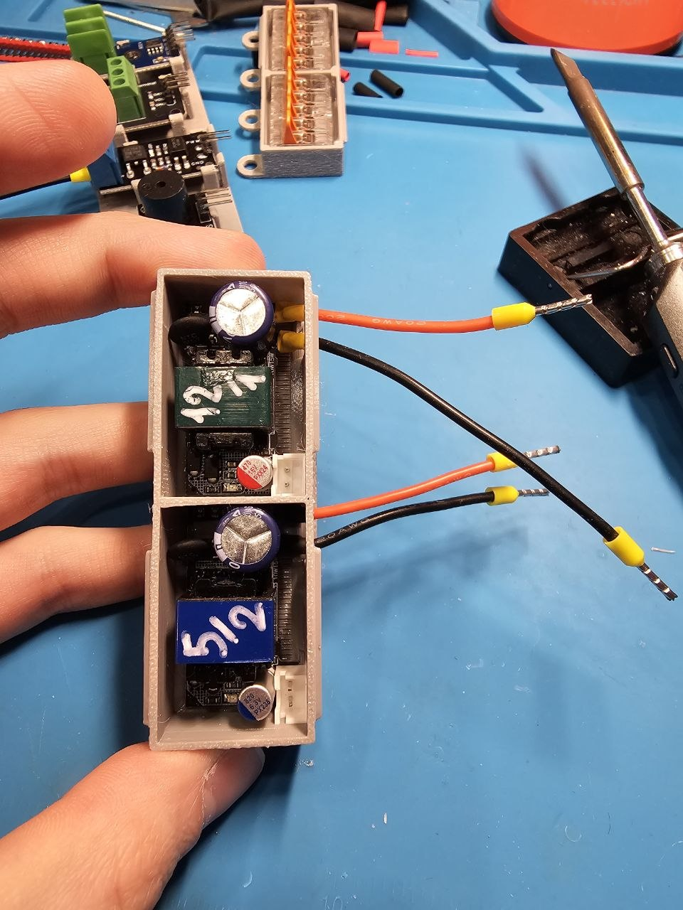
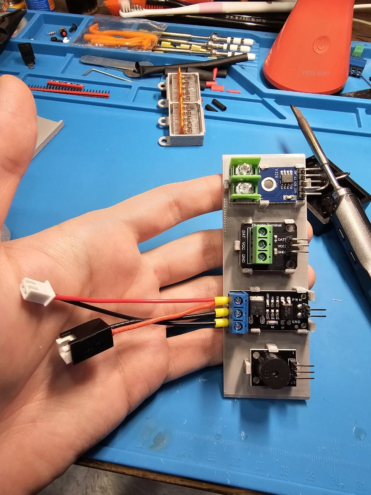

[🔙 На главную](../README.md)

# Сборка FLOOK32

## 🛠️ Что понадобится

| Инструмент | Для чего | Можно без него? |
|-----------|----------|------------------|
| Паяльник | БП 5В и БП 12В, ESP01S, шина 5В | ❌ Нет |
| Кримпер для НШВИ | Оконцевание проводов 220В | ❌ Нет |
| Обжим для РП | KCD11 и C8 | ✅ Да |

---

## ✅ Что можно упростить

| Деталь | Как упростить |
|--------|----------------|
| KCD11 и C8 | Контакты можно просто припаять |
| Dupont-перемычки | Покупайте только качественные с позолоченными или никелированными контактами. Дешёвые перемычки с ферромагнитными контактами (магнитятся) имеют высокое сопротивление и склонны к окислению и ослаблению контакта.|
| JST XH 2.54 | Купить уже обжатые готовые провода |

---

## ❌ Что нельзя упрощать

| Деталь | Почему |
|--------|--------|
| **НШВИ** | Провода 220В **обязательно** обжать гильзами. Без НШВИ провод со временем ослабнет и начнёт греться. DS18B20 обычно поставляется не обжатым, обязательно обжать. ESP01S питание и SSR G3MB-202P обжать питание и сигнальный провод |
| **Паяльник** | У БП S15W10E только площадки под пайку. Связь между ESP32 (GPIO26) и ESP01S (GPIO2). У ESP01S нет готового выхода GPIO2 — либо припаять угловой штырек вместо штатного, либо припаять провод напрямую. |

---
# В РАЗРАБОТКЕ
# 📋 Подготовка

## 1. Внешний блок
### 1.1 5В шина

### 1.2 Розетка С8
### 1.3 LED WS2812B
### 1.4 MOSFET LR7843

### 1.5 ESP32D

### 1.6 Шина 220В

### 1.7 Блоки питания

### 1.8 ESP01S и G3MB-202P
### 1.9 Перемычки

## 2. Внутренний блок
### 2.1 LED 12В
### 2.2 Нагреватель

# 📋 Сборка

## 1. Внешний блок
### 1.1 Резьбовые втулки
### 1.2 5В шина
### 1.3 LED WS2812B
### 1.4 Тактовая кнопка сброса
### 1.5 ESP32D
### 1.6 Переключатель KCD11
### 1.7 Розетка С8
### 1.8 Шина 220В
### 1.9 Блоки питания
### 1.10 ESP01S и G3MB-202P
### 1.11 Установка модулей

### 1.12 Магниты

## 2. Внутренний блок
### 2.1 Резьбовые втулки
### 2.2 LED 12В
### 2.3 Нагреватель
### 2.4 XH2.54
### 2.5 Магниты
### 2.6 Заглушки
### 2.7 Вентилятор

## 3. Рекомендации по проверкам
### 3.1 Проверка линии 220В
### 3.2 Проверка напряжения блоков питания
### 3.3 Проверка XH2.54 внутреннего блока

# 📋 Установка блоков

## 1. Внутренний блок
### 1.1 Установка гофры
### 1.2 Крышка
### 1.3 Прокладка проводов

## 2. Внешний блок
### 1.1 Нагреватель
### 1.2 Датчик температуры воздуха DS18B20
### 1.3 Термопара и линия 12В
### 1.4 Установка гофры
### 1.5 Крышка

# 📋 Проверка работоспособности

### 1. ESP32D, LED WS2812B, Бипер KY-012
### 2. Тактовая кнопка сброса
### 3. ESP01S реле
### 4. SSR реле, нагреватель, термопара
### 5. Вентилятор и LED 12В
### 6. Датчик температуры воздуха DS18B20

[🔝 Наверх](#сборка-flook32)

---

[🔙 На главную](../README.md)
